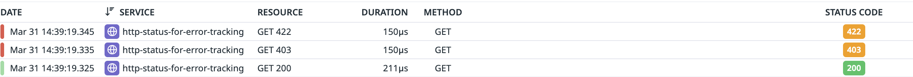
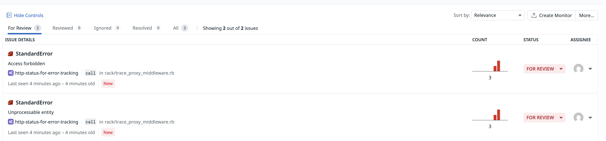

# dd-trace-ruby-http-error-statuses

---

## English

### Overview

A minimal Ruby + Rack demo comparing three approaches to handling 4xx HTTP errors in Datadog APM and Error Tracking.

By default, the Datadog Ruby tracer only marks **5xx responses** as errors. This demo shows:

1. What happens without any configuration (default behavior)
2. How `DD_TRACE_HTTP_SERVER_ERROR_STATUSES` makes 4xx responses appear as errors in APM Traces Explorer
3. How `span.set_error` enables full Error Tracking (Issues) by attaching `error.type`, `error.message`, and `error.stack`

### Key difference

| | `DD_TRACE_HTTP_SERVER_ERROR_STATUSES` | `span.set_error` |
|---|---|---|
| Sets `span.status = 1` (error) | ✅ | ✅ |
| Sets `error.type` / `error.message` / `error.stack` | ❌ | ✅ |
| Visible in APM Traces Explorer as error | ✅ | ✅ |
| Creates Issues in Error Tracking | ❌ | ✅ |

### Services comparison

| Service | Configuration | APM error | Error Tracking |
|---------|--------------|-----------|----------------|
| `http-status-before` | Default (nothing set) | ❌ | ❌ |
| `http-status-after` | `DD_TRACE_HTTP_SERVER_ERROR_STATUSES=403,422,500-599` | ✅ | ❌ |
| `http-status-for-error-tracking` | `span.set_error` called in code | ✅ | ✅ |

### Prerequisites

- Docker & Docker Compose
- A Datadog account with APM enabled
- A valid Datadog API key

### Setup

**1. Clone the repository**

```bash
git clone https://github.com/yuandesu/dd-trace-ruby-http-error-statuses.git
cd dd-trace-ruby-http-error-statuses
```

**2. Create a `.env` file**

```bash
echo "DD_API_KEY=your_datadog_api_key_here" > .env
```

**3. Start all services**

```bash
docker compose up -d
```

| Container | Port | Description |
|-----------|------|-------------|
| `datadog-agent` | 8127 | Datadog Agent |
| `app-before` | 4001 | No error config (default) |
| `app-after` | 4002 | With `DD_TRACE_HTTP_SERVER_ERROR_STATUSES` |
| `app-for-error-tracking` | 4003 | With `span.set_error` |

**4. Send test requests**

```bash
bash test.sh
```

**5. Check results in Datadog**

- [APM → Traces](https://app.datadoghq.com/apm/traces) — filter by `env:local`
  - `http-status-before`: 403/422 spans appear normal (no error highlight)
  - `http-status-after`: 403/422 spans appear in red, but "Missing error message and stack trace"
  - `http-status-for-error-tracking`: 403/422 spans appear in red with full error details

- [APM → Error Tracking](https://app.datadoghq.com/apm/error-tracking) — filter by `env:local`
  - Only `http-status-for-error-tracking` creates Issues

**6. Teardown**

```bash
docker compose down
```

### Endpoints

| Path | HTTP Status |
|------|-------------|
| `/ok` | 200 |
| `/forbidden` | 403 |
| `/unprocessable` | 422 |

---

## 日本語

### 概要

Ruby + Rack で作った最小構成のデモです。4xx レスポンスを Datadog APM / Error Tracking でどう扱うかを、3 つのパターンで比較します。

Datadog Ruby トレーサーはデフォルトで **5xx レスポンスのみ**をエラーとしてマークします。このデモでは以下を確認できます。

1. 何も設定しない場合（デフォルト動作）
2. `DD_TRACE_HTTP_SERVER_ERROR_STATUSES` を使って 4xx を APM Traces Explorer にエラーとして表示する方法
3. `span.set_error` を使って `error.type` / `error.message` / `error.stack` を付与し、Error Tracking（Issues）を有効にする方法

### 設定の違い

| | `DD_TRACE_HTTP_SERVER_ERROR_STATUSES` | `span.set_error` |
|---|---|---|
| `span.status = 1`（エラー）に設定 | ✅ | ✅ |
| `error.type` / `error.message` / `error.stack` を付与 | ❌ | ✅ |
| APM Traces Explorer にエラー表示 | ✅ | ✅ |
| Error Tracking に Issue 作成 | ❌ | ✅ |

### サービス比較

| サービス | 設定 | APM エラー | Error Tracking |
|---------|------|-----------|----------------|
| `http-status-before` | デフォルト（未設定） | ❌ | ❌ |
| `http-status-after` | `DD_TRACE_HTTP_SERVER_ERROR_STATUSES=403,422,500-599` | ✅ | ❌ |
| `http-status-for-error-tracking` | コード内で `span.set_error` を呼び出す | ✅ | ✅ |

### 必要なもの

- Docker & Docker Compose
- APM が有効な Datadog アカウント
- 有効な Datadog API キー

### セットアップ

**1. リポジトリをクローン**

```bash
git clone https://github.com/yuandesu/dd-trace-ruby-http-error-statuses.git
cd dd-trace-ruby-http-error-statuses
```

**2. `.env` ファイルを作成**

```bash
echo "DD_API_KEY=your_datadog_api_key_here" > .env
```

**3. 全サービスを起動**

```bash
docker compose up -d
```

| コンテナ | ポート | 説明 |
|---------|--------|------|
| `datadog-agent` | 8127 | Datadog Agent |
| `app-before` | 4001 | エラー設定なし（デフォルト） |
| `app-after` | 4002 | `DD_TRACE_HTTP_SERVER_ERROR_STATUSES` あり |
| `app-for-error-tracking` | 4003 | `span.set_error` あり |

**4. テストリクエストを送信**

```bash
bash test.sh
```

**5. Datadog で確認**

- [APM → Traces](https://app.datadoghq.com/apm/traces) — `env:local` でフィルタ
  - `http-status-before`: 403/422 のスパンはエラー表示なし（グレー）
  - `http-status-after`: 403/422 のスパンが赤く表示されるが「Missing error message and stack trace」
  - `http-status-for-error-tracking`: 403/422 のスパンが赤く表示され、エラー詳細も確認できる

- [APM → Error Tracking](https://app.datadoghq.com/apm/error-tracking) — `env:local` でフィルタ
  - `http-status-for-error-tracking` のみ Issue が作成される

**6. 停止**

```bash
docker compose down
```

### エンドポイント

| パス | HTTP ステータス |
|------|----------------|
| `/ok` | 200 |
| `/forbidden` | 403 |
| `/unprocessable` | 422 |

---

## Screenshots

### Traces list — both services side by side / トレース一覧の比較

`http-status-before` shows 403/422 as normal, while `http-status-after` shows them in red.

`http-status-before` では 403/422 がエラー表示されず、`http-status-after` では赤く表示される。


### Before: GET 422 span detail / before の 422 スパン詳細

No error flag. The span is treated as a normal response — no "Errors" tab, no error message.

エラーフラグなし。通常レスポンスとして扱われ、「Errors」タブもエラーメッセージも表示されない。


### After: GET 422 span detail / after の 422 スパン詳細

Span is marked as error (`status=1`). The "Errors" tab appears, but shows **"Missing error message and stack trace"** because `error.type` / `error.message` are not set.

`span.status=1` に設定されエラー表示されるが、`error.type` / `error.message` がないため「Missing error message and stack trace」と表示される。`DD_TRACE_HTTP_SERVER_ERROR_STATUSES` だけでは Error Tracking には届かない。


### For Error Tracking: GET 422 span detail / for-error-tracking の 422 スパン詳細

`span.set_error` sets `span.status=1` AND full error tags. The "Errors" tab shows complete error details.

`span.set_error` により `span.status=1` とエラータグが同時にセットされ、エラーの全詳細が表示される。



### Error Tracking — Issues list / Error Tracking の Issue 一覧

Only `http-status-for-error-tracking` creates Issues, because it is the only service that sets `error.type` / `error.message` / `error.stack`.

`error.type` / `error.message` / `error.stack` を付与している `http-status-for-error-tracking` のみ Issue が作成される。



---

## Related / 関連リンク

- [Datadog docs: DD_TRACE_HTTP_SERVER_ERROR_STATUSES](https://docs.datadoghq.com/tracing/trace_collection/library_config/#integrations:~:text=DD_TRACE_HTTP_SERVER_ERROR_STATUSES)
- [Datadog docs: Use span attributes to track error spans](https://docs.datadoghq.com/tracing/error_tracking/#use-span-attributes-to-track-error-spans)
- [dd-trace-rb](https://github.com/DataDog/dd-trace-rb)
