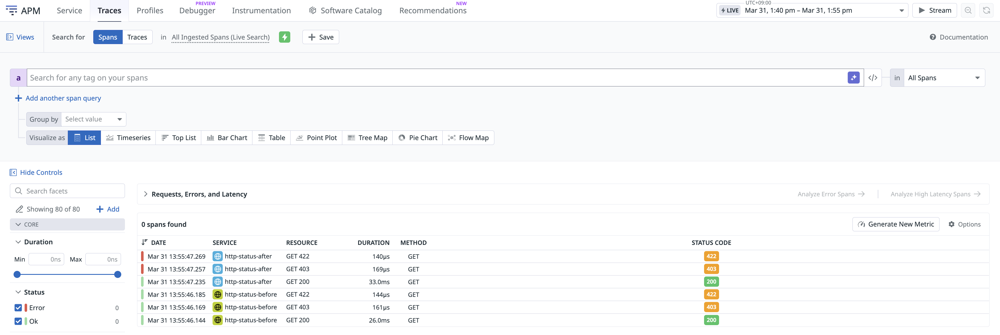
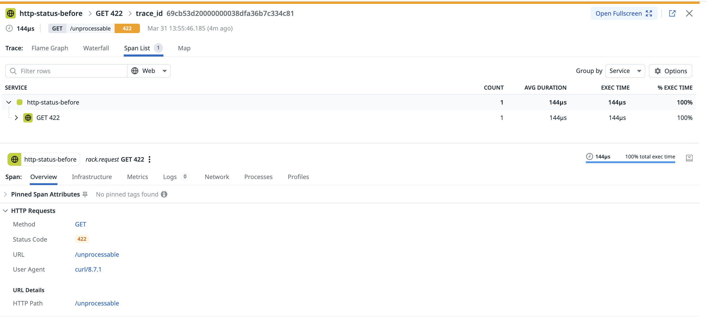
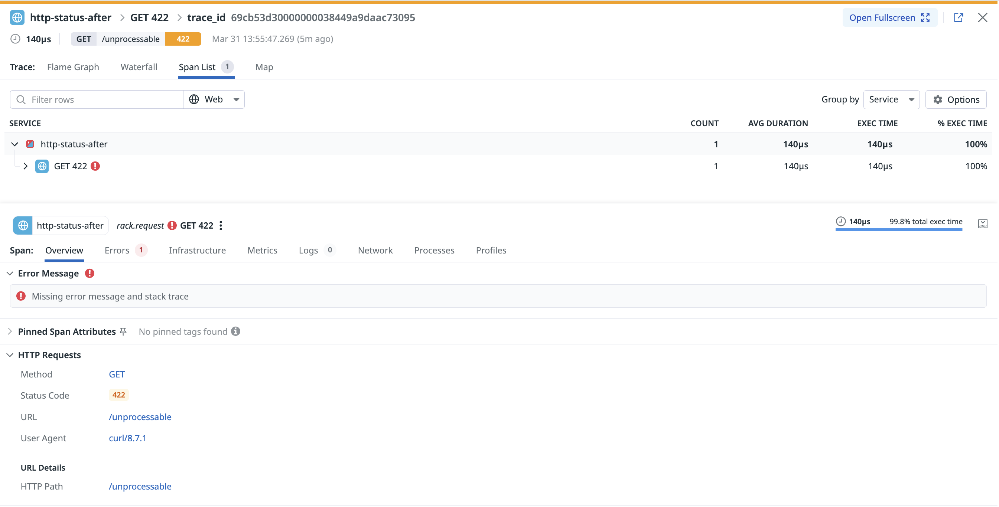

# dd-trace-ruby-http-error-statuses

A minimal Ruby + Rack demo that shows the **before/after difference** of setting `DD_TRACE_HTTP_SERVER_ERROR_STATUSES` in Datadog APM.

By default, the Datadog Ruby tracer only marks HTTP 5xx responses as errors. This demo shows that by setting `DD_TRACE_HTTP_SERVER_ERROR_STATUSES`, you can also make 4xx responses (e.g. 403, 422) appear as errors in APM Traces Explorer.

## What this demo shows

| Scenario | `DD_TRACE_HTTP_SERVER_ERROR_STATUSES` | 403 / 422 span status | APM error |
|----------|--------------------------------------|----------------------|-----------|
| `before` | not set (default)                    | `status=0`           | ❌        |
| `after`  | `403,422,500-599`                    | `status=1`           | ✅        |

> **Note:** Setting `DD_TRACE_HTTP_SERVER_ERROR_STATUSES` alone marks the span as an error (`status=1`) but does **not** set `error.type` or `error.message`. Therefore, errors will appear in the APM Traces Explorer but **will not** create Issues in Error Tracking.

## Prerequisites

- Docker & Docker Compose
- A Datadog account with APM enabled
- A valid Datadog API key

## Setup

**1. Clone the repository**

```bash
git clone https://github.com/yuandesu/dd-trace-ruby-http-error-statuses.git
cd dd-trace-ruby-http-error-statuses
```

**2. Create a `.env` file with your Datadog API key**

```bash
echo "DD_API_KEY={your_dd_api_key}" > .env
```

**3. Start all services**

```bash
docker compose up -d
```

This starts:
- `datadog-agent` — Datadog Agent (port 8127 on host)
- `app-before` — Rack app without `DD_TRACE_HTTP_SERVER_ERROR_STATUSES` (port 4001)
- `app-after` — Rack app with `DD_TRACE_HTTP_SERVER_ERROR_STATUSES=403,422,500-599` (port 4002)

**4. Send test requests**

```bash
bash test.sh
```

**5. Check results in Datadog**

Go to [APM → Traces](https://app.datadoghq.com/apm/traces) and filter by `env:local`.

- `service:http-status-before` — 403/422 spans show no error (grey)
- `service:http-status-after` — 403/422 spans show as errors (red)

## Screenshots

### Traces list — both services side by side

`http-status-before` shows 403/422 as normal (no error highlight), while `http-status-after` shows them in red.



### Before: GET 422 span detail

No error flag. The span is treated as a normal response — no "Errors" tab, no error message.



### After: GET 422 span detail

Span is marked as error (`status=1`). The "Errors" tab appears, but shows **"Missing error message and stack trace"** because `error.type` / `error.message` are not set. This is the limitation of `DD_TRACE_HTTP_SERVER_ERROR_STATUSES` alone.



## Endpoints

| Path            | HTTP Status |
|-----------------|-------------|
| `/ok`           | 200         |
| `/forbidden`    | 403         |
| `/unprocessable`| 422         |

## Teardown

```bash
docker compose down
```

## Related

- [Datadog docs: DD_TRACE_HTTP_SERVER_ERROR_STATUSES](https://docs.datadoghq.com/tracing/trace_collection/library_config/#integrations:~:text=DD_TRACE_HTTP_SERVER_ERROR_STATUSES)
- [dd-trace-rb](https://github.com/DataDog/dd-trace-rb)
